## Instructions
Answer the following questions and complete the exercises in RMarkdown. Please embed all of your code and push your final work to your repository. Your final lab report should be organized, clean, and run free from errors. Remember, you must remove the `#` for the included code chunks to run. Be sure to add your name to the author header above. For any included plots, make sure they are clearly labeled. You are free to use any plot type that you feel best communicates the results of your analysis.  

**In this homework, you should make use of the aesthetics you have learned. It's OK to be flashy!**

Make sure to use the formatting conventions of RMarkdown to make your report neat and clean!  

## Load the libraries

```r
library(tidyverse)
library(janitor)
library(here)
library(naniar)
```

## Resources
The idea for this assignment came from [Rebecca Barter's](http://www.rebeccabarter.com/blog/2017-11-17-ggplot2_tutorial/) ggplot tutorial so if you get stuck this is a good place to have a look.  

## Gapminder
For this assignment, we are going to use the dataset [gapminder](https://cran.r-project.org/web/packages/gapminder/index.html). Gapminder includes information about economics, population, and life expectancy from countries all over the world. You will need to install it before use. This is the same data that we will use for midterm 2 so this is good practice.

```r
#install.packages("gapminder")
library("gapminder")
```

## Questions
The questions below are open-ended and have many possible solutions. Your approach should, where appropriate, include numerical summaries and visuals. Be creative; assume you are building an analysis that you would ultimately present to an audience of stakeholders. Feel free to try out different `geoms` if they more clearly present your results.  

**1. Use the function(s) of your choice to get an idea of the overall structure of the data frame, including its dimensions, column names, variable classes, etc. As part of this, determine how NA's are treated in the data.**  

Setup

```r
library(ggthemes)
ls("package:ggthemes")[grepl("theme_", ls("package:ggthemes"))]
```

```
##  [1] "theme_base"            "theme_calc"            "theme_clean"          
##  [4] "theme_economist"       "theme_economist_white" "theme_excel"          
##  [7] "theme_excel_new"       "theme_few"             "theme_fivethirtyeight"
## [10] "theme_foundation"      "theme_gdocs"           "theme_hc"             
## [13] "theme_igray"           "theme_map"             "theme_pander"         
## [16] "theme_par"             "theme_solarized"       "theme_solarized_2"    
## [19] "theme_solid"           "theme_stata"           "theme_tufte"          
## [22] "theme_wsj"
```


```r
options(scipen=999) 
```

Overview

```r
gapminder
```

```
## # A tibble: 1,704 × 6
##    country     continent  year lifeExp      pop gdpPercap
##    <fct>       <fct>     <int>   <dbl>    <int>     <dbl>
##  1 Afghanistan Asia       1952    28.8  8425333      779.
##  2 Afghanistan Asia       1957    30.3  9240934      821.
##  3 Afghanistan Asia       1962    32.0 10267083      853.
##  4 Afghanistan Asia       1967    34.0 11537966      836.
##  5 Afghanistan Asia       1972    36.1 13079460      740.
##  6 Afghanistan Asia       1977    38.4 14880372      786.
##  7 Afghanistan Asia       1982    39.9 12881816      978.
##  8 Afghanistan Asia       1987    40.8 13867957      852.
##  9 Afghanistan Asia       1992    41.7 16317921      649.
## 10 Afghanistan Asia       1997    41.8 22227415      635.
## # … with 1,694 more rows
```


```r
glimpse(gapminder)
```

```
## Rows: 1,704
## Columns: 6
## $ country   <fct> "Afghanistan", "Afghanistan", "Afghanistan", "Afghanistan", …
## $ continent <fct> Asia, Asia, Asia, Asia, Asia, Asia, Asia, Asia, Asia, Asia, …
## $ year      <int> 1952, 1957, 1962, 1967, 1972, 1977, 1982, 1987, 1992, 1997, …
## $ lifeExp   <dbl> 28.801, 30.332, 31.997, 34.020, 36.088, 38.438, 39.854, 40.8…
## $ pop       <int> 8425333, 9240934, 10267083, 11537966, 13079460, 14880372, 12…
## $ gdpPercap <dbl> 779.4453, 820.8530, 853.1007, 836.1971, 739.9811, 786.1134, …
```

NA Summary

```r
miss_var_summary(gapminder)
```

```
## # A tibble: 6 × 3
##   variable  n_miss pct_miss
##   <chr>      <int>    <dbl>
## 1 country        0        0
## 2 continent      0        0
## 3 year           0        0
## 4 lifeExp        0        0
## 5 pop            0        0
## 6 gdpPercap      0        0
```

Value Summary

```r
summary(gapminder)
```

```
##         country        continent        year         lifeExp     
##  Afghanistan:  12   Africa  :624   Min.   :1952   Min.   :23.60  
##  Albania    :  12   Americas:300   1st Qu.:1966   1st Qu.:48.20  
##  Algeria    :  12   Asia    :396   Median :1980   Median :60.71  
##  Angola     :  12   Europe  :360   Mean   :1980   Mean   :59.47  
##  Argentina  :  12   Oceania : 24   3rd Qu.:1993   3rd Qu.:70.85  
##  Australia  :  12                  Max.   :2007   Max.   :82.60  
##  (Other)    :1632                                                
##       pop               gdpPercap       
##  Min.   :     60011   Min.   :   241.2  
##  1st Qu.:   2793664   1st Qu.:  1202.1  
##  Median :   7023596   Median :  3531.8  
##  Mean   :  29601212   Mean   :  7215.3  
##  3rd Qu.:  19585222   3rd Qu.:  9325.5  
##  Max.   :1318683096   Max.   :113523.1  
## 
```

Check Names

```r
names(gapminder)
```

```
## [1] "country"   "continent" "year"      "lifeExp"   "pop"       "gdpPercap"
```


**2. Among the interesting variables in gapminder is life expectancy. How has global life expectancy changed between 1952 and 2007?**

Reference

```r
summary(gapminder$year) #check range of years
```

```
##    Min. 1st Qu.  Median    Mean 3rd Qu.    Max. 
##    1952    1966    1980    1980    1993    2007
```


```r
gapminder %>% #create x~y relationship between year and average life expectancy
  select(lifeExp, year) %>% 
  group_by(year) %>% 
  summarize(avg_lifeExp = mean(lifeExp)) %>% 
  arrange(year) 
```

```
## # A tibble: 12 × 2
##     year avg_lifeExp
##    <int>       <dbl>
##  1  1952        49.1
##  2  1957        51.5
##  3  1962        53.6
##  4  1967        55.7
##  5  1972        57.6
##  6  1977        59.6
##  7  1982        61.5
##  8  1987        63.2
##  9  1992        64.2
## 10  1997        65.0
## 11  2002        65.7
## 12  2007        67.0
```

Plot: Global Life Expectancy (1952-2007)

```r
gapminder %>% 
  select(lifeExp, year) %>% 
  group_by(year) %>% 
  summarize(avg_lifeExp = mean(lifeExp)) %>% 
  ggplot(aes(x = year, y = avg_lifeExp))+
  geom_line()+
  geom_point()+
  labs(x = "Year",
       y = "Average Life Expectancy (Years)",
       title = "Global Life Expectancy (1952-2007)")+
  theme_linedraw()+
  theme(plot.title = element_text(hjust = 0.5))
```

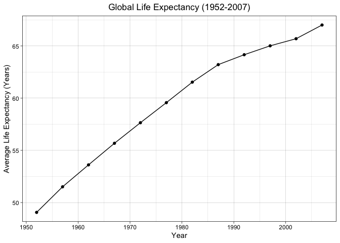<!-- -->


**3. How do the distributions of life expectancy compare for the years 1952 and 2007?**

Reference: Life Expectancy Frequency (1952)

```r
lifeExp_1952 <- gapminder %>% 
  select(year, lifeExp) %>% 
  filter(year == 1952) %>% 
  arrange(lifeExp)
lifeExp_1952
```

```
## # A tibble: 142 × 2
##     year lifeExp
##    <int>   <dbl>
##  1  1952    28.8
##  2  1952    30  
##  3  1952    30.0
##  4  1952    30.3
##  5  1952    31.3
##  6  1952    32.0
##  7  1952    32.5
##  8  1952    32.5
##  9  1952    33.0
## 10  1952    33.6
## # … with 132 more rows
```

Plot: Life Expectancy Frequency (1952)

```r
lifeExp_1952 %>% 
  ggplot(aes(x = lifeExp))+
  geom_histogram(aes(y = ..density..), alpha = 0.5, fill = "lightgray", color = "gray2")+
  geom_density(fill = "salmon", alpha = 0.2)+
  labs(x = "Life Expectancy (Years)",
       y = "Frequency",
       title = "Life Expectancy Frequency (1952)")+
  theme_linedraw()+
  theme(plot.title = element_text(hjust = 0.5))
```

```
## `stat_bin()` using `bins = 30`. Pick better value with `binwidth`.
```

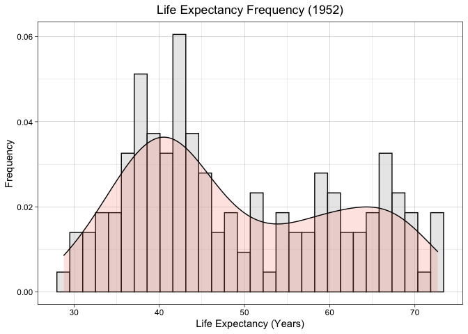<!-- -->

Reference: Life Expectancy Frequency (2007)

```r
lifeExp_2007 <- gapminder %>% 
  select(year, lifeExp) %>% 
  filter(year == 2007) %>% 
  arrange(lifeExp)
lifeExp_2007
```

```
## # A tibble: 142 × 2
##     year lifeExp
##    <int>   <dbl>
##  1  2007    39.6
##  2  2007    42.1
##  3  2007    42.4
##  4  2007    42.6
##  5  2007    42.6
##  6  2007    42.7
##  7  2007    43.5
##  8  2007    43.8
##  9  2007    44.7
## 10  2007    45.7
## # … with 132 more rows
```

Plot: Life Expectancy Frequency (2007)

```r
lifeExp_2007 %>% 
  ggplot(aes(x = lifeExp))+
  geom_histogram(aes(y = ..density..), alpha = 0.5, fill = "lightgray", color = "gray2")+
  geom_density(fill = "turquoise", alpha = 0.2)+
  labs(x = "Life Expectancy (Years)",
       y = "Frequency",
       title = "Life Expectancy Frequency (2007)")+
  theme_linedraw()
```

```
## `stat_bin()` using `bins = 30`. Pick better value with `binwidth`.
```

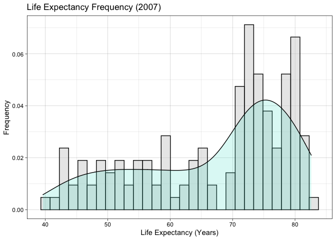<!-- -->

Reference: Life Expectancy Frequency (1952, 2007)

```r
gapminder %>% 
  select(year, lifeExp) %>% 
  filter(year == 1952 | year == 2007) %>% 
  arrange(lifeExp)
```

```
## # A tibble: 284 × 2
##     year lifeExp
##    <int>   <dbl>
##  1  1952    28.8
##  2  1952    30  
##  3  1952    30.0
##  4  1952    30.3
##  5  1952    31.3
##  6  1952    32.0
##  7  1952    32.5
##  8  1952    32.5
##  9  1952    33.0
## 10  1952    33.6
## # … with 274 more rows
```

Plot: Life Expectancy Frequency (1952, 2007)

```r
ggplot(lifeExp_1952, aes(x = lifeExp))+
  geom_density(aes(fill = "1952"), alpha = 0.5)+
  geom_density(data = lifeExp_2007, aes(x = lifeExp, fill = "2007"), alpha = 0.5)+
  labs(x = "Life Expectancy (Years)",
       y = "Frequency",
       title = "Life Expectancy Frequency (1952, 2007)",
       fill = "Year")+
  theme_linedraw()+
  theme(plot.title = element_text(hjust = 0.5))
```

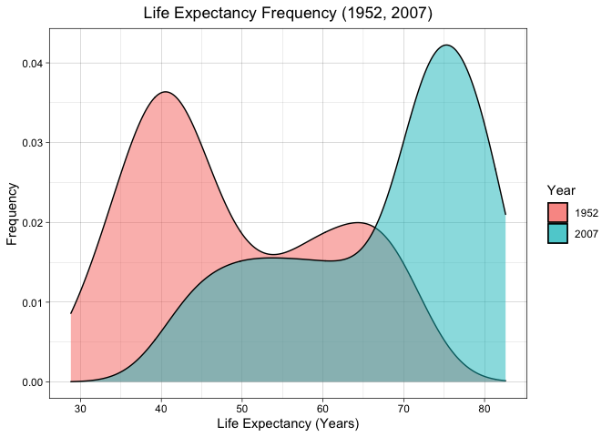<!-- -->


**4. Your answer above doesn't tell the whole story since life expectancy varies by region. Make a summary that shows the min, mean, and max life expectancy by continent for all years represented in the data.**

Reference: Life Expectancy Range by Continent

```r
gapminder %>% 
  group_by(continent) %>% 
  summarize(min_lifeExp = min(lifeExp),
            mean_lifeExp = mean(lifeExp),
            max_lifeExp = max(lifeExp))
```

```
## # A tibble: 5 × 4
##   continent min_lifeExp mean_lifeExp max_lifeExp
##   <fct>           <dbl>        <dbl>       <dbl>
## 1 Africa           23.6         48.9        76.4
## 2 Americas         37.6         64.7        80.7
## 3 Asia             28.8         60.1        82.6
## 4 Europe           43.6         71.9        81.8
## 5 Oceania          69.1         74.3        81.2
```

Plot: Life Expectancy Range by Continent

```r
gapminder %>% 
  ggplot(aes(x = continent, y = lifeExp))+
  geom_boxplot(fill = "mediumorchid")+
  labs(x = "Continent",
       y = "Life Expectancy (Years)",
       title = "Life Expectancy Range by Continent")+
  theme_linedraw()+
  theme(plot.title = element_text(hjust = 0.5))
```

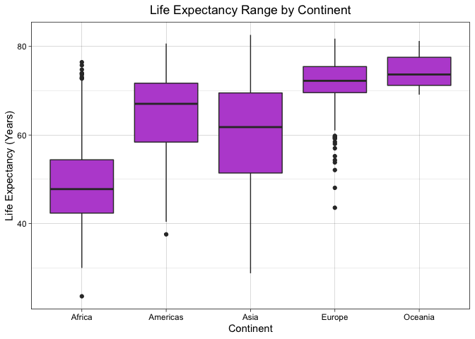<!-- -->


**5. How has life expectancy changed between 1952-2007 for each continent?**

Reference: Average Life Expectancy by Continent Over Time

```r
lifeExp_continent_yr <- gapminder %>% 
  group_by(continent, year) %>% 
  summarize(avg_lifeExp = mean(lifeExp))
```

```
## `summarise()` has grouped output by 'continent'. You can override using the `.groups` argument.
```

```r
lifeExp_continent_yr
```

```
## # A tibble: 60 × 3
## # Groups:   continent [5]
##    continent  year avg_lifeExp
##    <fct>     <int>       <dbl>
##  1 Africa     1952        39.1
##  2 Africa     1957        41.3
##  3 Africa     1962        43.3
##  4 Africa     1967        45.3
##  5 Africa     1972        47.5
##  6 Africa     1977        49.6
##  7 Africa     1982        51.6
##  8 Africa     1987        53.3
##  9 Africa     1992        53.6
## 10 Africa     1997        53.6
## # … with 50 more rows
```

Plot: Average Life Expectancy by Continent Over Time

```r
lifeExp_continent_yr %>% 
  ggplot(aes(x = year, y = avg_lifeExp, color = continent))+
  geom_line()+
  labs(x = "Year",
       y = "Average Life Expectancy (Years)",
       title = "Average Life Expectancy by Continent Over Time",
       color = "Continent")+
  theme_linedraw()+
  theme(plot.title = element_text(hjust = 0.5))
```

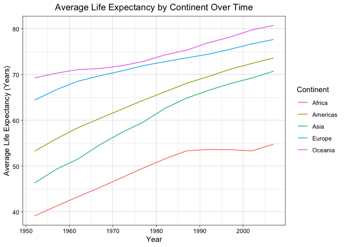<!-- -->

Plot: Life Expectancy by Continent Over Time

```r
gapminder %>% 
  ggplot(aes(x = year, y = lifeExp))+
  geom_line(aes(group = country), alpha = 0.3)+
  geom_line(data = lifeExp_continent_yr, aes(x = year, y = avg_lifeExp), color = "red", size = 1, alpha = 0.6)+
  facet_wrap(~continent, ncol = 5)+
  labs(x = "Year",
       y = "Life Expectancy (Years)",
       title = "Life Expectancy by Continent Over Time",
       caption = "*Gray lines represent individual countries' life expectancies;
       Red lines represent the average among life expectencies per continent")+
  theme_linedraw()+
  theme(plot.title = element_text(hjust = 0.5),
        axis.text.x = element_text(angle = 70, vjust = 0.5),
        plot.caption = element_text(hjust = 0.5, color = "gray50"))
```

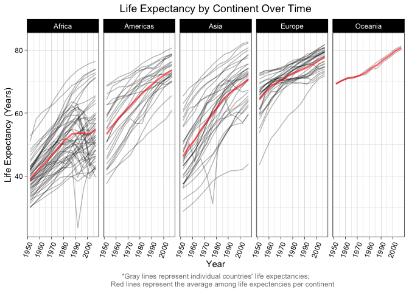<!-- -->


**6. We are interested in the relationship between per capita GDP and life expectancy; i.e. does having more money help you live longer?**

Reference: Life Expectancy vs. GDP per Capita

```r
gapminder %>% 
  select(gdpPercap, lifeExp) %>% 
  arrange(gdpPercap)
```

```
## # A tibble: 1,704 × 2
##    gdpPercap lifeExp
##        <dbl>   <dbl>
##  1      241.    45.0
##  2      278.    46.5
##  3      299.    42.1
##  4      300.    32.5
##  5      312.    42.6
##  6      329.    35.9
##  7      331     36.3
##  8      336.    45.0
##  9      339.    39.0
## 10      344.    38.0
## # … with 1,694 more rows
```

Plot: Life Expectancy vs. GDP per Capita

```r
gapminder %>% 
  ggplot(aes(x = gdpPercap, y = lifeExp))+
  geom_jitter(alpha = 0.2)+
  scale_x_log10()+
  geom_smooth(method = "lm", se = F, color = "firebrick")+
  labs(x = "GDP per Capita (USD)",
       y = "Life Expectancy (Years)",
       title = "Life Expectancy vs. GDP per Capita")+
  theme_linedraw()+
  theme(plot.title = element_text(hjust = 0.5))
```

```
## `geom_smooth()` using formula 'y ~ x'
```

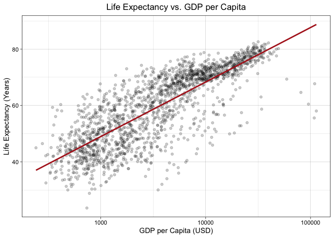<!-- -->


**7. Which countries have had the largest population growth since 1952?**


```r
country_pop_growth <- gapminder %>% 
  select(country, pop, year) %>% 
  filter(year == max(year) | year == min(year)) %>% 
  group_by(country) %>% 
  summarize(pop_growth = max(pop)-min(pop)) %>% 
  arrange(desc(pop_growth))
country_pop_growth
```

```
## # A tibble: 142 × 2
##    country       pop_growth
##    <fct>              <int>
##  1 China          762419569
##  2 India          738396331
##  3 United States  143586947
##  4 Indonesia      141495000
##  5 Brazil         133408087
##  6 Pakistan       127924057
##  7 Bangladesh     103561480
##  8 Nigeria        101912068
##  9 Mexico          78556574
## 10 Philippines     68638596
## # … with 132 more rows
```

**8. Use your results from the question above to plot population growth for the top five countries since 1952.**

Reference: Top 5 Countries by Population Growth

```r
country_pop_growth %>% 
  top_n(n = 5)
```

```
## Selecting by pop_growth
```

```
## # A tibble: 5 × 2
##   country       pop_growth
##   <fct>              <int>
## 1 China          762419569
## 2 India          738396331
## 3 United States  143586947
## 4 Indonesia      141495000
## 5 Brazil         133408087
```

Plot: Population Growth (Overall)

```r
country_pop_growth %>% 
  head(n = 5) %>% 
  ggplot(aes(x = reorder(country, pop_growth), y = pop_growth/(10^6)))+
  geom_col(fill = "orchid3")+
  labs(x = "Country",
       y = "Population Growth (Millions of People)",
       caption = "Population growth for top 5 largest growing countries from 1952 to 2007")+
  theme_linedraw()+
  theme(plot.caption = element_text(hjust = 0.5, color = "gray50"))
```

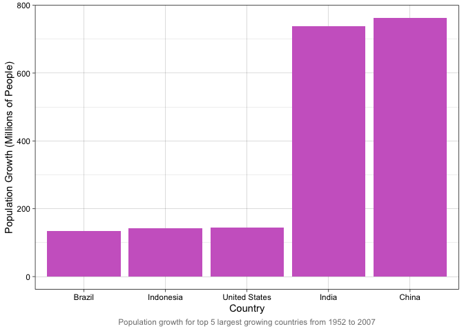<!-- -->

Plot: Population Growth (Over Time)

```r
gapminder %>% 
  filter(country %in% 
           c("Brazil","China","India","Indonesia","United States")) %>% 
  ggplot(aes(x = year, y = pop/(10^6), color = country))+
  geom_line()+
  labs(x = "Year",
       y = "Population (Millions of People)",
       color = "Country",
       caption = "Population growth over time for the top five countries with the highest population growth from 1952 to 2007")+
  theme_linedraw()+
  theme(plot.caption = element_text(hjust = 0.5, color = "gray50"))
```

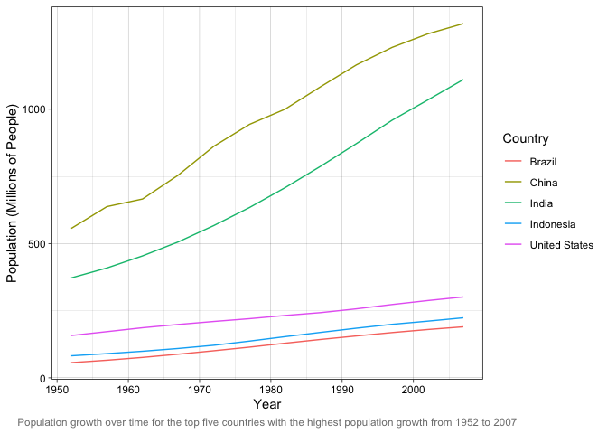<!-- -->


**9. How does per-capita GDP growth compare between these same five countries?**

Reference: GDP per Capita Growth (Overall)

```r
top5_GDP_growth <- gapminder %>% 
  filter(country %in% c("Brazil","China","India","Indonesia","United States"),
         year == 1952 |year == 2007) %>% 
  group_by(country) %>% 
  summarize(gdpPercap_growth = max(gdpPercap)-min(gdpPercap)) %>%
  arrange(gdpPercap_growth)
top5_GDP_growth
```

```
## # A tibble: 5 × 2
##   country       gdpPercap_growth
##   <fct>                    <dbl>
## 1 India                    1906.
## 2 Indonesia                2791.
## 3 China                    4559.
## 4 Brazil                   6957.
## 5 United States           28961.
```

Plot: GDP per Capita Growth (Overall)

```r
top5_GDP_growth %>% 
  ggplot(aes(x = reorder(country, gdpPercap_growth), y = gdpPercap_growth))+
  geom_col(fill = "orchid3")+
  labs(x = "Country",
       y = "GDP per Capita Growth (USD)",
       caption = "GDP per capita growth among the top five growing countries by population from 1952 to 2007")+
  theme_linedraw()+
  theme(plot.caption = element_text(hjust = 0.5, color = "gray50"))
```

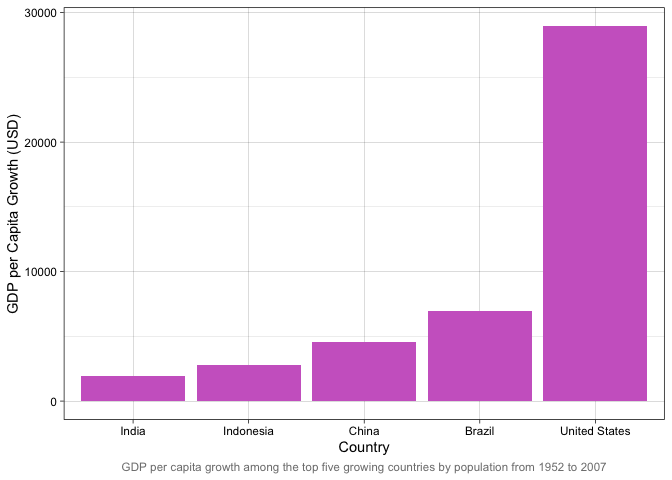<!-- -->

Reference: GDP per Capita Growth (Over Time)

```r
gapminder %>% 
  filter(country %in% c("Brazil","China","India","Indonesia","United States")) %>% 
  select(country, year, gdpPercap)
```

```
## # A tibble: 60 × 3
##    country  year gdpPercap
##    <fct>   <int>     <dbl>
##  1 Brazil   1952     2109.
##  2 Brazil   1957     2487.
##  3 Brazil   1962     3337.
##  4 Brazil   1967     3430.
##  5 Brazil   1972     4986.
##  6 Brazil   1977     6660.
##  7 Brazil   1982     7031.
##  8 Brazil   1987     7807.
##  9 Brazil   1992     6950.
## 10 Brazil   1997     7958.
## # … with 50 more rows
```

Plot: GDP per Capita Growth (Over Time)

```r
gapminder %>% 
  filter(country %in% c("Brazil","China","India","Indonesia","United States")) %>% 
  select(country, year, gdpPercap) %>% 
  ggplot(aes(x = year, y = gdpPercap, color = country))+
  geom_line()+
  labs(x = "Year",
       y = "GDP per Capita (USD)",
       color = "Country",
       caption = "GDP per capita over time for the top five greatest growing countries from 1952 to 2007")+
  theme_linedraw()+
  theme(plot.caption = element_text(hjust = 0.5, color = "gray50"))
```

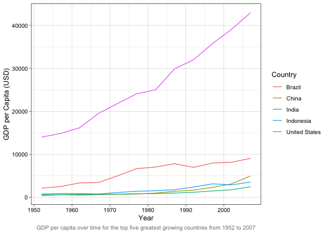<!-- -->


**10. Make one plot of your choice that uses faceting!**

*Note: I know we didn't learn this in class yet, but this looked interesting and fun to try out, so I chose to do it anyways.

Has initial population size affected each country's ability to promote population growth from 1952 to 2007?

References:

```r
 gapminder %>% #check spread of population data in 1952
  filter(year == 1952) %>% 
  select(pop) %>% 
  summary()
```

```
##       pop           
##  Min.   :    60011  
##  1st Qu.:  1452026  
##  Median :  3943953  
##  Mean   : 16950402  
##  3rd Qu.:  9168198  
##  Max.   :556263527
```


```r
country_size_set <- gapminder %>% #set country size categories based on 1952 standards
  mutate(country_size = case_when(pop < 1452026 ~"small",
                                  pop >= 1452026 & pop < 3943953 ~"medium",
                                  pop >= 3943953 & pop < 9168198 ~ "large",
                                  pop >= 9168198 ~"very_large"))
country_size_set
```

```
## # A tibble: 1,704 × 7
##    country     continent  year lifeExp      pop gdpPercap country_size
##    <fct>       <fct>     <int>   <dbl>    <int>     <dbl> <chr>       
##  1 Afghanistan Asia       1952    28.8  8425333      779. large       
##  2 Afghanistan Asia       1957    30.3  9240934      821. very_large  
##  3 Afghanistan Asia       1962    32.0 10267083      853. very_large  
##  4 Afghanistan Asia       1967    34.0 11537966      836. very_large  
##  5 Afghanistan Asia       1972    36.1 13079460      740. very_large  
##  6 Afghanistan Asia       1977    38.4 14880372      786. very_large  
##  7 Afghanistan Asia       1982    39.9 12881816      978. very_large  
##  8 Afghanistan Asia       1987    40.8 13867957      852. very_large  
##  9 Afghanistan Asia       1992    41.7 16317921      649. very_large  
## 10 Afghanistan Asia       1997    41.8 22227415      635. very_large  
## # … with 1,694 more rows
```


```r
country_size_list <- country_size_set %>% #list each country with their 1952 size
  filter(year == 1952) %>% 
  select(country, country_size)
country_size_list
```

```
## # A tibble: 142 × 2
##    country     country_size
##    <fct>       <chr>       
##  1 Afghanistan large       
##  2 Albania     small       
##  3 Algeria     very_large  
##  4 Angola      large       
##  5 Argentina   very_large  
##  6 Australia   large       
##  7 Austria     large       
##  8 Bahrain     small       
##  9 Bangladesh  very_large  
## 10 Belgium     large       
## # … with 132 more rows
```


```r
growth_potential <- country_size_set %>% #find %population growth from 1952 to 2007
  filter(year == 1952 | year == 2007) %>% 
  group_by(country) %>% 
  summarize(percent_pop_growth = 100*max(pop)/min(pop)) %>% 
  mutate(country_size_list) #juxtapose %population growth with 1952 size
growth_potential %>% 
  arrange(desc(percent_pop_growth)) #view largest %population growths
```

```
## # A tibble: 142 × 3
##    country       percent_pop_growth country_size
##    <fct>                      <dbl> <chr>       
##  1 Kuwait                     1566. small       
##  2 Jordan                      996. small       
##  3 Djibouti                    786. small       
##  4 Saudi Arabia                689. large       
##  5 Oman                        631. small       
##  6 Cote d'Ivoire               605. medium      
##  7 Gambia                      594. small       
##  8 Libya                       592. small       
##  9 Bahrain                     588. small       
## 10 Kenya                       551. large       
## # … with 132 more rows
```

Plot: Percent Population Growth Density (Overall)

```r
growth_potential %>% #overall 
  ggplot(aes(x = percent_pop_growth))+
  geom_histogram(aes(y = ..density..), alpha = 0.5, fill = "powderblue", color = "gray2")+
  geom_density(fill = "lightgray", alpha = 0.2)+
  labs(x = "Population Growth (%)",
       y = "Frequency",
       title = "Percent Population Growth Density (1952-2007)")+
  theme_linedraw()+
  theme(plot.title = element_text(hjust = 0.5))
```

```
## `stat_bin()` using `bins = 30`. Pick better value with `binwidth`.
```

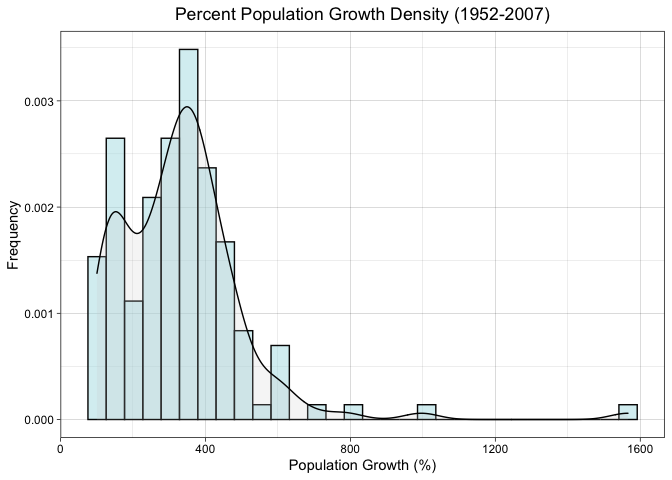<!-- -->

Plot: Percent Population Growth Density (By Country Size)

```r
growth_potential %>% 
  ggplot(aes(x = percent_pop_growth))+
  geom_histogram(aes(y = ..density..), alpha = 0.5, fill = "powderblue", color = "gray2")+
  geom_density(fill = "lightgray", alpha = 0.2)+
  facet_wrap(~country_size, nrow = 4)+
  labs(x = "Population Growth (%)",
       y = "Frequency",
       title = "Percent Population Growth Density by 1952 Country Size (1952-2007)")+
  theme_linedraw()+
  theme(plot.title = element_text(hjust = 0.5))
```

```
## `stat_bin()` using `bins = 30`. Pick better value with `binwidth`.
```

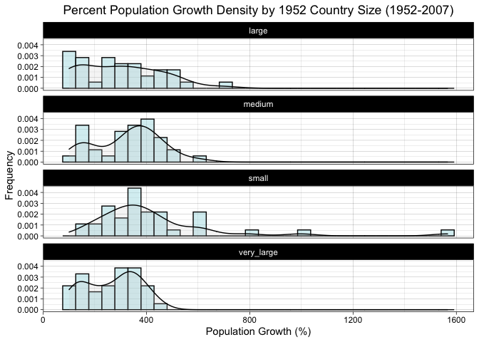<!-- -->

## Push your final code to GitHub!
Please be sure that you check the `keep md` file in the knit preferences. 
