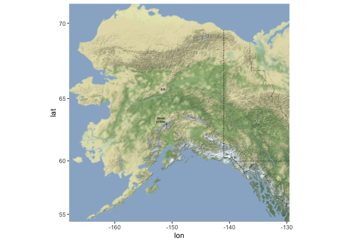
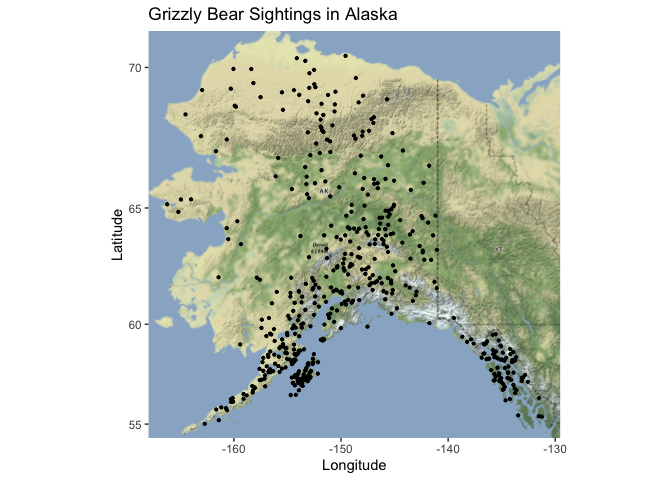
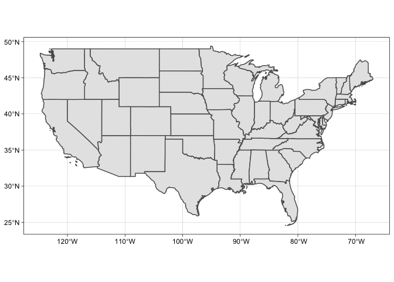
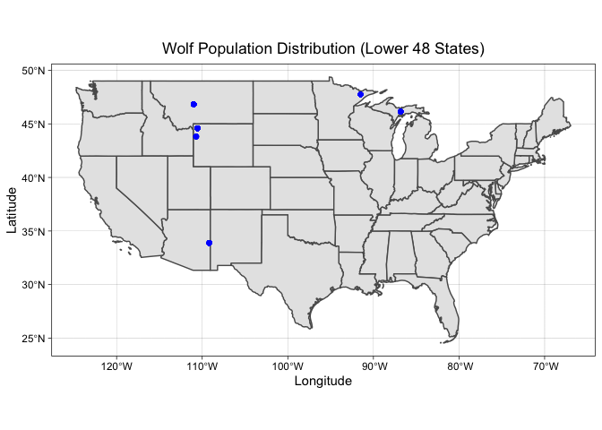
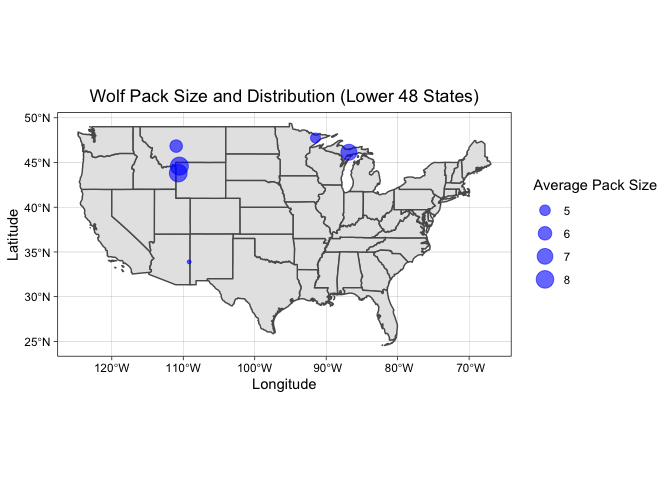

## Instructions
Answer the following questions and complete the exercises in RMarkdown. Please embed all of your code and push your final work to your repository. Your final lab report should be organized, clean, and run free from errors. Remember, you must remove the `#` for the included code chunks to run. Be sure to add your name to the author header above. For any included plots, make sure they are clearly labeled. You are free to use any plot type that you feel best communicates the results of your analysis.  

Make sure to use the formatting conventions of RMarkdown to make your report neat and clean!  

## Load the libraries

```r
library(tidyverse)
library(janitor)
library(here)
library(ggmap)
library(albersusa)
```

## Load the Data
We will use two separate data sets for this homework.  

**1. The first [data set](https://rcweb.dartmouth.edu/~f002d69/workshops/index_rspatial.html) represent sightings of grizzly bears (Ursos arctos) in Alaska.**

**2. The second data set is from Brandell, Ellen E (2021), Serological dataset and R code for: Patterns and processes of pathogen exposure in gray wolves across North America, Dryad, [Dataset](https://doi.org/10.5061/dryad.5hqbzkh51).**  

**1. Load the `grizzly` data and evaluate its structure. As part of this step, produce a summary that provides the range of latitude and longitude so you can build an appropriate bounding box.**

```r
grizzly <- read.csv("data/bear-sightings.csv")
head(grizzly)
```

```
##   bear.id longitude latitude
## 1       7 -148.9560 62.65822
## 2      57 -152.6228 58.35064
## 3      69 -144.9374 62.38227
## 4      75 -152.8485 59.90122
## 5     104 -143.2948 61.07311
## 6     108 -149.7111 62.91605
```

```r
glimpse(grizzly)
```

```
## Rows: 494
## Columns: 3
## $ bear.id   <int> 7, 57, 69, 75, 104, 108, 115, 116, 125, 135, 137, 162, 185, …
## $ longitude <dbl> -148.9560, -152.6228, -144.9374, -152.8485, -143.2948, -149.…
## $ latitude  <dbl> 62.65822, 58.35064, 62.38227, 59.90122, 61.07311, 62.91605, …
```


```r
summary(grizzly)
```

```
##     bear.id       longitude         latitude    
##  Min.   :   7   Min.   :-166.2   Min.   :55.02  
##  1st Qu.:2569   1st Qu.:-154.2   1st Qu.:58.13  
##  Median :4822   Median :-151.0   Median :60.97  
##  Mean   :4935   Mean   :-149.1   Mean   :61.41  
##  3rd Qu.:7387   3rd Qu.:-145.6   3rd Qu.:64.13  
##  Max.   :9996   Max.   :-131.3   Max.   :70.37
```
<br/>
<br/>
**2. Use the range of the latitude and longitude to build an appropriate bounding box for your map.**

```r
grizzly_lon <- c(min(grizzly$longitude), max(grizzly$longitude))
grizzly_lon
```

```
## [1] -166.2336 -131.2621
```


```r
grizzly_lat <- c(min(grizzly$latitude), max(grizzly$latitude))
grizzly_lat
```

```
## [1] 55.01637 70.36742
```


```r
grizzly_bbox <- make_bbox(grizzly_lon, grizzly_lat, f = 0.05)
```
<br/>
<br/>
**3. Load a map from `stamen` in a terrain style projection and display the map.**

```r
grizzly_map <- get_map(grizzly_bbox, maptype = "terrain", source = "stamen")
```

```
## Map tiles by Stamen Design, under CC BY 3.0. Data by OpenStreetMap, under ODbL.
```


```r
ggmap(grizzly_map)
```

<!-- -->
<br/>
<br/>
**4. Build a final map that overlays the recorded observations of grizzly bears in Alaska.**

```r
ggmap(grizzly_map)+
  geom_point(data = grizzly, aes(longitude, latitude), size = 0.8)+
  labs(x = "Longitude",
       y = "Latitude",
       title = "Grizzly Bear Sightings in Alaska")
```

<!-- -->
<br/>
<br/>
**5. Let's switch to the wolves data. Load the data and evaluate its structure.**

```r
wolves <- read.csv("data/wolves_data/wolves_dataset.csv")
head(wolves)
```

```
##      pop year age.cat sex color      lat      long habitat human pop.density
## 1 AK.PEN 2006       S   F     G 57.03983 -157.8427  254.08 10.42           8
## 2 AK.PEN 2006       S   M     G 57.03983 -157.8427  254.08 10.42           8
## 3 AK.PEN 2006       A   F     G 57.03983 -157.8427  254.08 10.42           8
## 4 AK.PEN 2006       S   M     B 57.03983 -157.8427  254.08 10.42           8
## 5 AK.PEN 2006       A   M     B 57.03983 -157.8427  254.08 10.42           8
## 6 AK.PEN 2006       A   M     G 57.03983 -157.8427  254.08 10.42           8
##   pack.size standard.habitat standard.human standard.pop standard.packsize
## 1      8.78          -1.6339        -0.9784      -0.6827            1.3157
## 2      8.78          -1.6339        -0.9784      -0.6827            1.3157
## 3      8.78          -1.6339        -0.9784      -0.6827            1.3157
## 4      8.78          -1.6339        -0.9784      -0.6827            1.3157
## 5      8.78          -1.6339        -0.9784      -0.6827            1.3157
## 6      8.78          -1.6339        -0.9784      -0.6827            1.3157
##   standard.latitude standard.longitude cav.binary cdv.binary cpv.binary
## 1            0.7214            -2.1441          1          0          0
## 2            0.7214            -2.1441          1          0          0
## 3            0.7214            -2.1441          1          0          1
## 4            0.7214            -2.1441          0          0          1
## 5            0.7214            -2.1441          1          0          0
## 6            0.7214            -2.1441          1          1          1
##   chv.binary neo.binary toxo.binary
## 1          1         NA          NA
## 2          1         NA          NA
## 3          1         NA          NA
## 4          1          0           1
## 5          1          0           0
## 6          1         NA          NA
```


```r
glimpse(wolves)
```

```
## Rows: 1,986
## Columns: 23
## $ pop                <chr> "AK.PEN", "AK.PEN", "AK.PEN", "AK.PEN", "AK.PEN", "…
## $ year               <int> 2006, 2006, 2006, 2006, 2006, 2006, 2006, 2006, 200…
## $ age.cat            <chr> "S", "S", "A", "S", "A", "A", "A", "P", "S", "P", "…
## $ sex                <chr> "F", "M", "F", "M", "M", "M", "F", "M", "F", "M", "…
## $ color              <chr> "G", "G", "G", "B", "B", "G", "G", "G", "G", "G", "…
## $ lat                <dbl> 57.03983, 57.03983, 57.03983, 57.03983, 57.03983, 5…
## $ long               <dbl> -157.8427, -157.8427, -157.8427, -157.8427, -157.84…
## $ habitat            <dbl> 254.08, 254.08, 254.08, 254.08, 254.08, 254.08, 254…
## $ human              <dbl> 10.42, 10.42, 10.42, 10.42, 10.42, 10.42, 10.42, 10…
## $ pop.density        <dbl> 8, 8, 8, 8, 8, 8, 8, 8, 8, 8, 8, 8, 8, 8, 8, 8, 8, …
## $ pack.size          <dbl> 8.78, 8.78, 8.78, 8.78, 8.78, 8.78, 8.78, 8.78, 8.7…
## $ standard.habitat   <dbl> -1.6339, -1.6339, -1.6339, -1.6339, -1.6339, -1.633…
## $ standard.human     <dbl> -0.9784, -0.9784, -0.9784, -0.9784, -0.9784, -0.978…
## $ standard.pop       <dbl> -0.6827, -0.6827, -0.6827, -0.6827, -0.6827, -0.682…
## $ standard.packsize  <dbl> 1.3157, 1.3157, 1.3157, 1.3157, 1.3157, 1.3157, 1.3…
## $ standard.latitude  <dbl> 0.7214, 0.7214, 0.7214, 0.7214, 0.7214, 0.7214, 0.7…
## $ standard.longitude <dbl> -2.1441, -2.1441, -2.1441, -2.1441, -2.1441, -2.144…
## $ cav.binary         <int> 1, 1, 1, 0, 1, 1, 1, 1, 1, 1, 1, 1, 1, 1, 1, 1, 1, …
## $ cdv.binary         <int> 0, 0, 0, 0, 0, 1, 0, 0, 0, 0, 0, 0, 0, 0, 0, 0, 0, …
## $ cpv.binary         <int> 0, 0, 1, 1, 0, 1, 0, 0, 0, 0, 1, 0, 0, 1, 0, 0, 0, …
## $ chv.binary         <int> 1, 1, 1, 1, 1, 1, 1, 1, 1, 0, 1, 1, 1, 1, 1, 1, 1, …
## $ neo.binary         <int> NA, NA, NA, 0, 0, NA, NA, 1, 0, 1, NA, 0, NA, NA, N…
## $ toxo.binary        <int> NA, NA, NA, 1, 0, NA, NA, 1, 0, 0, NA, 0, NA, NA, N…
```
<br/>
<br/>
**6. How many distinct wolf populations are included in this study? Make a new object that restricts the data to the wolf populations in the lower 48 US states.**


```r
wolves %>% 
  summarize(distinct_wolf_pop = n_distinct(pop))
```

```
##   distinct_wolf_pop
## 1                17
```


```r
levels(as.factor(wolves$pop))
```

```
##  [1] "AK.PEN"  "BAN.JAS" "BC"      "DENALI"  "ELLES"   "GTNP"    "INT.AK" 
##  [8] "MEXICAN" "MI"      "MT"      "N.NWT"   "ONT"     "SE.AK"   "SNF"    
## [15] "SS.NWT"  "YNP"     "YUCH"
```


```r
lower_48 <- wolves %>% 
  filter(pop == c("MT","YNP","GTNP","MEXICAN","MI","SNF"))
head(lower_48)
```

```
##    pop year age.cat sex color      lat      long  habitat   human pop.density
## 1 GTNP 2012       P   M     G 43.81817 -110.7055 10375.16 3924.09       33.96
## 2 GTNP 2013       P   M     G 43.81817 -110.7055 10375.16 3924.09       33.96
## 3 GTNP 2013       P   M     B 43.81817 -110.7055 10375.16 3924.09       33.96
## 4 GTNP 2014       A   M     G 43.81817 -110.7055 10375.16 3924.09       33.96
## 5 GTNP 2014       S   M     B 43.81817 -110.7055 10375.16 3924.09       33.96
## 6 GTNP 2015       P   M     B 43.81817 -110.7055 10375.16 3924.09       33.96
##   pack.size standard.habitat standard.human standard.pop standard.packsize
## 1       8.1          -0.3062         0.9144       2.0715             0.916
## 2       8.1          -0.3062         0.9144       2.0715             0.916
## 3       8.1          -0.3062         0.9144       2.0715             0.916
## 4       8.1          -0.3062         0.9144       2.0715             0.916
## 5       8.1          -0.3062         0.9144       2.0715             0.916
## 6       8.1          -0.3062         0.9144       2.0715             0.916
##   standard.latitude standard.longitude cav.binary cdv.binary cpv.binary
## 1           -0.7219             0.3219          1          0          1
## 2           -0.7219             0.3219          1          0          1
## 3           -0.7219             0.3219          0          0          0
## 4           -0.7219             0.3219          1          0          1
## 5           -0.7219             0.3219          1          1          1
## 6           -0.7219             0.3219          0          0          0
##   chv.binary neo.binary toxo.binary
## 1          1          0           0
## 2          1          0           0
## 3          1          0           0
## 4          1          1           0
## 5          1          1           1
## 6          1          1           1
```
<br/>
<br/>
**7. Use the `albersusa` package to make a base map of the lower 48 US states.**

```r
us_comp <- usa_sf()
lower_48_base <- us_comp %>% 
  filter(name != "Alaska", name != "Hawaii")
```

```
## old-style crs object detected; please recreate object with a recent sf::st_crs()
```


```r
ggplot()+
  geom_sf(data = lower_48_base)+
  theme_linedraw()
```

<!-- -->
<br/>
<br/>
**8. Use the relimited data to plot the distribution of wolf populations in the lower 48 US states.**

```r
ggplot()+
  geom_sf(data = lower_48_base)+
  theme_linedraw()+
  geom_point(data = lower_48, aes(long, lat), color = "blue", size = 1.5)+
  labs(x = "Longitude",
       y = "Latitude",
       title = "Wolf Population Distribution (Lower 48 States)")+
  theme(plot.title = element_text(hjust = 0.5))
```

<!-- -->
<br/>
<br/>
**9. What is the average pack size for the wolves in this study by region?**

```r
pack_size <- lower_48 %>% 
  group_by(pop, long, lat) %>% 
  summarize(avg_pack_size = mean(pack.size))
```

```
## `summarise()` has grouped output by 'pop', 'long'. You can override using the
## `.groups` argument.
```

```r
pack_size
```

```
## # A tibble: 6 × 4
## # Groups:   pop, long [6]
##   pop       long   lat avg_pack_size
##   <chr>    <dbl> <dbl>         <dbl>
## 1 GTNP    -111.   43.8          8.1 
## 2 MEXICAN -109.   33.9          4.04
## 3 MI       -86.8  46.1          7.12
## 4 MT      -111.   46.8          5.62
## 5 SNF      -91.5  47.7          4.81
## 6 YNP     -111.   44.6          8.25
```
<br/>
<br/>
**10. Make a new map that shows the distribution of wolves in the lower 48 US states but which has the size of location markers adjusted by pack size.**

```r
ggplot()+
  geom_sf(data = lower_48_base)+
  theme_linedraw()+
  geom_point(data = pack_size, aes(long, lat, size = avg_pack_size), color = "blue", alpha = 0.6)+
  theme(plot.title = element_text(hjust = 0.5))+
  labs(x = "Longitude",
       y = "Latitude",
       title = "Wolf Pack Size and Distribution (Lower 48 States)",
       size = "Average Pack Size")
```

<!-- -->

## Push your final code to GitHub!
Please be sure that you check the `keep md` file in the knit preferences. 
