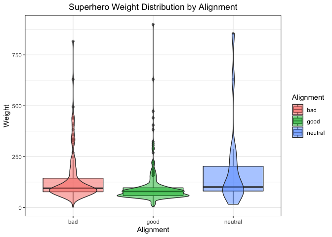
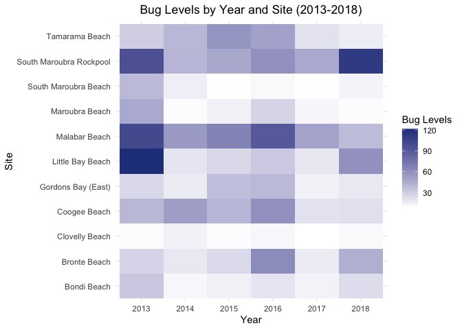

### Load the Libraries

```r
library(tidyverse)
```

```
## ── Attaching packages ─────────────────────────────────────── tidyverse 1.3.1 ──
```

```
## ✓ ggplot2 3.3.5     ✓ purrr   0.3.4
## ✓ tibble  3.1.6     ✓ dplyr   1.0.8
## ✓ tidyr   1.2.0     ✓ stringr 1.4.0
## ✓ readr   2.1.2     ✓ forcats 0.5.1
```

```
## ── Conflicts ────────────────────────────────────────── tidyverse_conflicts() ──
## x dplyr::filter() masks stats::filter()
## x dplyr::lag()    masks stats::lag()
```

```r
library(janitor)
```

```
## 
## Attaching package: 'janitor'
```

```
## The following objects are masked from 'package:stats':
## 
##     chisq.test, fisher.test
```

```r
library("palmerpenguins")

#install.packages("ggVennDiagram")
library(ggVennDiagram)
library(RColorBrewer)

#install.packages("ggworldcloud")
library(ggwordcloud)


options(scipen=999) #cancels the use of scientific notation for the session
```

### Data

```r
superhero_info <- readr::read_csv("data/heroes_information.csv", na = c("", "-99", "-"))
```

```
## Rows: 734 Columns: 10
## ── Column specification ────────────────────────────────────────────────────────
## Delimiter: ","
## chr (8): name, Gender, Eye color, Race, Hair color, Publisher, Skin color, A...
## dbl (2): Height, Weight
## 
## ℹ Use `spec()` to retrieve the full column specification for this data.
## ℹ Specify the column types or set `show_col_types = FALSE` to quiet this message.
```

```r
superhero_powers <- readr::read_csv("data/super_hero_powers.csv", na = c("", "-99", "-"))
```

```
## Rows: 667 Columns: 168
## ── Column specification ────────────────────────────────────────────────────────
## Delimiter: ","
## chr   (1): hero_names
## lgl (167): Agility, Accelerated Healing, Lantern Power Ring, Dimensional Awa...
## 
## ℹ Use `spec()` to retrieve the full column specification for this data.
## ℹ Specify the column types or set `show_col_types = FALSE` to quiet this message.
```

```r
beachbugs_long <- readr::read_csv("data/beachbugs_long.csv")
```

```
## Rows: 66 Columns: 3
## ── Column specification ────────────────────────────────────────────────────────
## Delimiter: ","
## chr (1): site
## dbl (2): year, buglevels
## 
## ℹ Use `spec()` to retrieve the full column specification for this data.
## ℹ Specify the column types or set `show_col_types = FALSE` to quiet this message.
```

### 1. 
Clean up the column names (no capitals, not spaces) of `superhero_info`, then use 2 functions to remind yourself of structure of the `superhero_info` data set.

```r
superhero_info <- superhero_info %>% 
  clean_names()
superhero_info
```

```
## # A tibble: 734 × 10
##    name  gender eye_color race  hair_color height publisher skin_color alignment
##    <chr> <chr>  <chr>     <chr> <chr>       <dbl> <chr>     <chr>      <chr>    
##  1 A-Bo… Male   yellow    Human No Hair       203 Marvel C… <NA>       good     
##  2 Abe … Male   blue      Icth… No Hair       191 Dark Hor… blue       good     
##  3 Abin… Male   blue      Unga… No Hair       185 DC Comics red        good     
##  4 Abom… Male   green     Huma… No Hair       203 Marvel C… <NA>       bad      
##  5 Abra… Male   blue      Cosm… Black          NA Marvel C… <NA>       bad      
##  6 Abso… Male   blue      Human No Hair       193 Marvel C… <NA>       bad      
##  7 Adam… Male   blue      <NA>  Blond          NA NBC - He… <NA>       good     
##  8 Adam… Male   blue      Human Blond         185 DC Comics <NA>       good     
##  9 Agen… Female blue      <NA>  Blond         173 Marvel C… <NA>       good     
## 10 Agen… Male   brown     Human Brown         178 Marvel C… <NA>       good     
## # … with 724 more rows, and 1 more variable: weight <dbl>
```

### 2.
Are bad guys bigger? Make box-plots of weight by `alignment` (alignment on the x-axis).

```r
wt_align <- superhero_info %>% 
  select(alignment, weight) %>% 
  filter(alignment != is.na(alignment))
wt_align
```

```
## # A tibble: 727 × 2
##    alignment weight
##    <chr>      <dbl>
##  1 good         441
##  2 good          65
##  3 good          90
##  4 bad          441
##  5 bad           NA
##  6 bad          122
##  7 good          NA
##  8 good          88
##  9 good          61
## 10 good          81
## # … with 717 more rows
```


```r
wt_align %>% 
  ggplot(aes(x = alignment, y = weight, fill = alignment))+
  geom_boxplot(alpha = 0.8)+
  theme_bw()+
  labs(x = "Alignment",
       y = "Weight",
       title = "Weight Distribution by Alignment",
       fill = "Alignment")+
  theme(plot.title = element_text(hjust = 0.5))
```

```
## Warning: Removed 235 rows containing non-finite values (stat_boxplot).
```

<!-- -->
<br/>
Bad guys tend to be larger than good guys, but around the same size as neutral-aligned characters.
<br/>

### 3. 
Now, make a violin plot of weight by `alignment` (alignment on the x-axis). Add some color!  

What information can you observe in the violin plot that was not visible in the boxplot?

```r
wt_align %>% 
  ggplot(aes(x = alignment, y = weight, fill = alignment))+
  geom_violin(alpha = 0.8)+
  theme_bw()+
  labs(x = "Alignment",
       y = "Weight",
       title = "Superhero Weight Distribution by Alignment",
       fill = "Alignment")+
  theme(plot.title = element_text(hjust = 0.5))
```

```
## Warning: Removed 235 rows containing non-finite values (stat_ydensity).
```

<!-- -->
<br/>
In the violin plots, the distribution of weight is better visualized than the box plots, namely the peaks in distribution such as the two peaks of weight distribution among the good guys that are invisible/compiled in the boxplot.
<br/>

### 4. 
Use `alpha = .5` in `geom_boxplot()` and `geom_violin()` to layer both plots on top of one another. What does this tell you about the distribution of weight in "`bad`" guys?

```r
wt_align %>% 
  ggplot(aes(x = alignment, y = weight, fill = alignment))+
  geom_boxplot(alpha = 0.5)+
  geom_violin(data = wt_align, aes(x = alignment, y = weight, fill = alignment), alpha = 0.5)+
  theme_bw()+
  labs(x = "Alignment",
       y = "Weight",
       title = "Superhero Weight Distribution by Alignment",
       fill = "Alignment")+
  theme(plot.title = element_text(hjust = 0.5))
```

```
## Warning: Removed 235 rows containing non-finite values (stat_boxplot).
```

```
## Warning: Removed 235 rows containing non-finite values (stat_ydensity).
```

<!-- -->
<br/>
The distribution of weight in bad guys is relatively normal, with a long right tail. It is also more concentrated than neutral characters and less concentrated than good guys.
<br/>

### 5. 
Box plots are great for showing how the distribution of a numeric variable (e.g. weight) varies among a categorical variable (e.g. alignment).
  Make your own violin plot with the superhero data.
  What is your numeric data?: `height`
  What is your categorical variable?: `gender``


```r
superhero_info %>% 
  filter(gender != is.na(gender)) %>% 
  ggplot(aes(x = gender, y = height, fill = gender))+
  geom_violin()+
  theme_bw()+
  labs(x = "Gender",
       y = "Height",
       title = "Superhero Height Distribution by Gender",
       fill = "Gender")+
  theme(plot.title = element_text(hjust = 0.5))+
  scale_fill_brewer(palette = "Set2")
```

```
## Warning: Removed 203 rows containing non-finite values (stat_ydensity).
```

<!-- -->
<br/>

### 6. 
Remind yourself what `beachbugs` looks like. Then generate a heatmap of buglevels by site and year.  

Color it with `scale_fill_gradient(low="yellow", high="red")` or colors of your choice. you may find it looks best with one color!  

(dont forget, `coord_flip()` is a quick way to improve the look of your plot if you dont like the default orientation)


```r
glimpse(beachbugs_long)
```

```
## Rows: 66
## Columns: 3
## $ year      <dbl> 2013, 2013, 2013, 2013, 2013, 2013, 2013, 2013, 2013, 2013, …
## $ site      <chr> "Bondi Beach", "Bronte Beach", "Clovelly Beach", "Coogee Bea…
## $ buglevels <dbl> 32.224138, 26.758621, 9.275862, 39.672414, 24.772727, 121.53…
```


```r
beachbugs_long %>% 
  ggplot(aes(x = as.factor(year), y = site, fill = buglevels))+
  geom_tile()+
  scale_fill_gradient(low = "white", high = "royalblue4")+
  labs(x = "Year",
       y = "Site",
       fill = "Bug Levels",
       title = "Bug Levels by Year and Site (2013-2018)")+
  theme_minimal()+
  theme(plot.title = element_text(hjust = 0.5))
```

<!-- -->
<br/>

### 7.  
Use the provided code to normalize the beachbug data set.  

Then make a heatmap with the `beachbugs_normalized` data, and use the same color chois as above. Which heatmap do you think is more informative? why?


```r
#makes a new column of the highest buglevel observed at each site
beachbugs_w_max <- beachbugs_long %>% 
  group_by(site) %>% 
  mutate(max_buglevel = max(buglevels, na.rm=T)) %>% 
  arrange(site)
beachbugs_w_max
```

```
## # A tibble: 66 × 4
## # Groups:   site [11]
##     year site         buglevels max_buglevel
##    <dbl> <chr>            <dbl>        <dbl>
##  1  2013 Bondi Beach       32.2         32.2
##  2  2014 Bondi Beach       11.1         32.2
##  3  2015 Bondi Beach       14.3         32.2
##  4  2016 Bondi Beach       19.4         32.2
##  5  2017 Bondi Beach       13.2         32.2
##  6  2018 Bondi Beach       22.9         32.2
##  7  2013 Bronte Beach      26.8         61.3
##  8  2014 Bronte Beach      17.5         61.3
##  9  2015 Bronte Beach      23.6         61.3
## 10  2016 Bronte Beach      61.3         61.3
## # … with 56 more rows
```

```r
#makes a new table where the buglevels are normalized to the max_buglevel
beachbugs_normalized <- beachbugs_w_max %>% 
  group_by(site) %>% 
  mutate(norm_buglevel = buglevels/max_buglevel) %>% 
  arrange(site,year) %>%
  select(site, year, norm_buglevel)   # you dont have to select(), but I think its a clearer looking table
beachbugs_normalized
```

```
## # A tibble: 66 × 3
## # Groups:   site [11]
##    site          year norm_buglevel
##    <chr>        <dbl>         <dbl>
##  1 Bondi Beach   2013         1    
##  2 Bondi Beach   2014         0.344
##  3 Bondi Beach   2015         0.445
##  4 Bondi Beach   2016         0.601
##  5 Bondi Beach   2017         0.409
##  6 Bondi Beach   2018         0.710
##  7 Bronte Beach  2013         0.436
##  8 Bronte Beach  2014         0.285
##  9 Bronte Beach  2015         0.385
## 10 Bronte Beach  2016         1    
## # … with 56 more rows
```
 

```r
beachbugs_normalized %>% 
  ggplot(aes(x = as.factor(year), y = site, fill = norm_buglevel))+
  geom_tile()+
  scale_fill_gradient(low = "white", high = "royalblue4")+
  labs(x = "Year",
       y = "Site",
       fill = "Normalized Bug Level",
       title = "Bug Levels by Year and Site (2013-2018)")+
  theme_minimal()+
  theme(plot.title = element_text(hjust = 0.5))
```

<!-- -->
<br/>
I think that the normalized version is more informative because it measures and displays bug levels based on the site rather than absolute values among all sites. Its more informative on how each site's bug levels are changing according to the each site's range of levels.
<br/>

### 8.
Let's make a venn diagram of `superhero_info`, from 4 questions:  

Is their alignment evil?
Are their eyes red?
Are they male?
Are they bald?  

Start by making the 4 vectors, then the list of vectors. The vector for alignment is provided:
### super heros venn

```r
# evil
evil_vec <- superhero_info %>%
  filter(alignment == "bad")%>%
  pull(name)

# red eyes
red_eye_vec <- superhero_info %>% 
  filter(eye_color == "red") %>% 
  pull(name)

# male
male_vec <- superhero_info %>% 
  filter(gender == "Male") %>% 
  pull(name)

# bald
bald_vec <- superhero_info %>% 
  filter(hair_color == "No Hair") %>% 
  pull(name)
```
<br/>
Your list of vectors will look something like this:

```r
questions_list <- list(evil_vec, red_eye_vec, male_vec, bald_vec)
```
<br/>

### 9. 
Let's make the venn diagram! use the code from lab as a reference. 

```r
# something like:
# ggVennDiagram( list, category.names = c("name", "name", "name", "name"))

ggVennDiagram(questions_list, category.names = c("Evil","Red Eyes","Male","Bald"))
```

<!-- -->
<br/>

### 10. Choose one intersection of the venn diagram that is interesting to you. Use dplyr to find the names of the superheros in that intersection. 

```r
superhero_info %>% 
  filter(gender == "Male",
         eye_color == "red",
         alignment == "bad",
         hair_color == "No Hair") %>% 
  pull(name)
```

```
## [1] "Darkseid"    "Demogoblin"  "Killer Croc" "Klaw"        "Lizard"     
## [6] "Onslaught"   "Swamp Thing" "Thanos"
```
<br/>

### 11. Make another venn diagram with the `superhero_info` data. What are your questions? ( At least 2!)  

Questions:
Are they from Dark Horse Comics?
Are they neutral?

```r
drk_horse_vec <- superhero_info %>% 
  filter(publisher == "Dark Horse Comics") %>% 
  pull(name)
drk_horse_vec
```

```
##  [1] "Abe Sapien"       "Alien"            "Angel"            "Buffy"           
##  [5] "Captain Midnight" "Dash"             "Elastigirl"       "Hellboy"         
##  [9] "Jack-Jack"        "Johann Krauss"    "Liz Sherman"      "Mr Incredible"   
## [13] "Predator"         "T-1000"           "T-800"            "T-850"           
## [17] "T-X"              "Violet Parr"
```


```r
neut_vec <- superhero_info %>% 
  filter(alignment == "good") %>% 
  pull(name)
neut_vec
```

```
##   [1] "A-Bomb"                    "Abe Sapien"               
##   [3] "Abin Sur"                  "Adam Monroe"              
##   [5] "Adam Strange"              "Agent 13"                 
##   [7] "Agent Bob"                 "Agent Zero"               
##   [9] "Alan Scott"                "Alex Woolsly"             
##  [11] "Alfred Pennyworth"         "Allan Quatermain"         
##  [13] "Ando Masahashi"            "Angel"                    
##  [15] "Angel"                     "Angel Dust"               
##  [17] "Angel Salvadore"           "Animal Man"               
##  [19] "Ant-Man"                   "Ant-Man II"               
##  [21] "Aquababy"                  "Aqualad"                  
##  [23] "Aquaman"                   "Arachne"                  
##  [25] "Archangel"                 "Ardina"                   
##  [27] "Ares"                      "Ariel"                    
##  [29] "Armor"                     "Arsenal"                  
##  [31] "Astro Boy"                 "Atlas"                    
##  [33] "Atom"                      "Atom"                     
##  [35] "Atom Girl"                 "Atom II"                  
##  [37] "Atom III"                  "Atom IV"                  
##  [39] "Aurora"                    "Azrael"                   
##  [41] "Aztar"                     "Banshee"                  
##  [43] "Bantam"                    "Batgirl"                  
##  [45] "Batgirl"                   "Batgirl III"              
##  [47] "Batgirl IV"                "Batgirl V"                
##  [49] "Batgirl VI"                "Batman"                   
##  [51] "Batman"                    "Batman II"                
##  [53] "Battlestar"                "Batwoman V"               
##  [55] "Beak"                      "Beast"                    
##  [57] "Beast Boy"                 "Ben 10"                   
##  [59] "Beta Ray Bill"             "Beyonder"                 
##  [61] "Big Daddy"                 "Bill Harken"              
##  [63] "Binary"                    "Bionic Woman"             
##  [65] "Bird-Brain"                "Birdman"                  
##  [67] "Bishop"                    "Black Bolt"               
##  [69] "Black Canary"              "Black Canary"             
##  [71] "Black Cat"                 "Black Goliath"            
##  [73] "Black Knight III"          "Black Lightning"          
##  [75] "Black Panther"             "Black Widow"              
##  [77] "Black Widow II"            "Blade"                    
##  [79] "Blaquesmith"               "Bling!"                   
##  [81] "Blink"                     "Bloodhawk"                
##  [83] "Blue Beetle"               "Blue Beetle"              
##  [85] "Blue Beetle II"            "Blue Beetle III"          
##  [87] "Bolt"                      "Boom-Boom"                
##  [89] "Boomer"                    "Booster Gold"             
##  [91] "Box"                       "Box III"                  
##  [93] "Box IV"                    "Brainiac 5"               
##  [95] "Brother Voodoo"            "Buffy"                    
##  [97] "Bumblebee"                 "Bumbleboy"                
##  [99] "Bushido"                   "Cable"                    
## [101] "Cameron Hicks"             "Cannonball"               
## [103] "Captain America"           "Captain Atom"             
## [105] "Captain Britain"           "Captain Epic"             
## [107] "Captain Hindsight"         "Captain Mar-vell"         
## [109] "Captain Marvel"            "Captain Marvel"           
## [111] "Captain Marvel II"         "Captain Midnight"         
## [113] "Captain Planet"            "Captain Universe"         
## [115] "Cat"                       "Cat II"                   
## [117] "Catwoman"                  "Cecilia Reyes"            
## [119] "Century"                   "Cerebra"                  
## [121] "Chamber"                   "Chuck Norris"             
## [123] "Citizen Steel"             "Claire Bennet"            
## [125] "Clea"                      "Cloak"                    
## [127] "Colin Wagner"              "Colossal Boy"             
## [129] "Colossus"                  "Corsair"                  
## [131] "Crimson Crusader"          "Crimson Dynamo"           
## [133] "Crystal"                   "Cyborg"                   
## [135] "Cyclops"                   "Cypher"                   
## [137] "Dagger"                    "Danny Cooper"             
## [139] "Daphne Powell"             "Daredevil"                
## [141] "Darkhawk"                  "Darkman"                  
## [143] "Darkstar"                  "Dash"                     
## [145] "Data"                      "Dazzler"                  
## [147] "Deadman"                   "Deathlok"                 
## [149] "DL Hawkins"                "Doc Samson"               
## [151] "Doctor Fate"               "Doctor Strange"           
## [153] "Domino"                    "Donatello"                
## [155] "Donna Troy"                "Dr Manhattan"             
## [157] "Drax the Destroyer"        "Elastigirl"               
## [159] "Elektra"                   "Elongated Man"            
## [161] "Emma Frost"                "Enchantress"              
## [163] "Energy"                    "ERG-1"                    
## [165] "Ethan Hunt"                "Falcon"                   
## [167] "Feral"                     "Fighting Spirit"          
## [169] "Fin Fang Foom"             "Firebird"                 
## [171] "Firelord"                  "Firestar"                 
## [173] "Firestorm"                 "Firestorm"                
## [175] "Flash"                     "Flash Gordon"             
## [177] "Flash II"                  "Flash III"                
## [179] "Flash IV"                  "Forge"                    
## [181] "Franklin Richards"         "Franklin Storm"           
## [183] "Frigga"                    "Gambit"                   
## [185] "Gamora"                    "Garbage Man"              
## [187] "Gary Bell"                 "Genesis"                  
## [189] "Ghost Rider"               "Ghost Rider II"           
## [191] "Giant-Man"                 "Giant-Man II"             
## [193] "Goku"                      "Goliath"                  
## [195] "Goliath"                   "Goliath"                  
## [197] "Goliath IV"                "Gravity"                  
## [199] "Green Arrow"               "Green Goblin III"         
## [201] "Green Goblin IV"           "Groot"                    
## [203] "Guardian"                  "Guy Gardner"              
## [205] "Hal Jordan"                "Han Solo"                 
## [207] "Hancock"                   "Harry Potter"             
## [209] "Havok"                     "Hawk"                     
## [211] "Hawkeye"                   "Hawkeye II"               
## [213] "Hawkgirl"                  "Hawkman"                  
## [215] "Hawkwoman"                 "Hawkwoman II"             
## [217] "Hawkwoman III"             "Hellboy"                  
## [219] "Hellcat"                   "Hellstorm"                
## [221] "Hercules"                  "Hiro Nakamura"            
## [223] "Hit-Girl"                  "Hollow"                   
## [225] "Hope Summers"              "Howard the Duck"          
## [227] "Hulk"                      "Human Torch"              
## [229] "Huntress"                  "Husk"                     
## [231] "Hybrid"                    "Hyperion"                 
## [233] "Iceman"                    "Impulse"                  
## [235] "Indiana Jones"             "Ink"                      
## [237] "Invisible Woman"           "Iron Fist"                
## [239] "Iron Man"                  "Isis"                     
## [241] "Jack Bauer"                "Jack of Hearts"           
## [243] "Jack-Jack"                 "James Bond"               
## [245] "James T. Kirk"             "Jar Jar Binks"            
## [247] "Jason Bourne"              "Jean Grey"                
## [249] "Jean-Luc Picard"           "Jennifer Kale"            
## [251] "Jesse Quick"               "Jessica Cruz"             
## [253] "Jessica Jones"             "Jessica Sanders"          
## [255] "Jim Powell"                "JJ Powell"                
## [257] "Johann Krauss"             "John Constantine"         
## [259] "John Stewart"              "John Wraith"              
## [261] "Jolt"                      "Jubilee"                  
## [263] "Judge Dredd"               "Justice"                  
## [265] "Jyn Erso"                  "K-2SO"                    
## [267] "Karate Kid"                "Kathryn Janeway"          
## [269] "Katniss Everdeen"          "Kevin 11"                 
## [271] "Kick-Ass"                  "Kid Flash"                
## [273] "Kid Flash II"              "Kilowog"                  
## [275] "King Kong"                 "Kool-Aid Man"             
## [277] "Krypto"                    "Kyle Rayner"              
## [279] "Leech"                     "Legion"                   
## [281] "Leonardo"                  "Light Lass"               
## [283] "Lightning Lad"             "Liz Sherman"              
## [285] "Longshot"                  "Luke Cage"                
## [287] "Luke Skywalker"            "Luna"                     
## [289] "Lyja"                      "Machine Man"              
## [291] "Magog"                     "Man-Thing"                
## [293] "Man-Wolf"                  "Mantis"                   
## [295] "Martian Manhunter"         "Marvel Girl"              
## [297] "Master Brood"              "Master Chief"             
## [299] "Matt Parkman"              "Maverick"                 
## [301] "Maya Herrera"              "Medusa"                   
## [303] "Meltdown"                  "Mera"                     
## [305] "Metamorpho"                "Meteorite"                
## [307] "Metron"                    "Micah Sanders"            
## [309] "Michelangelo"              "Micro Lad"                
## [311] "Mimic"                     "Minna Murray"             
## [313] "Misfit"                    "Miss Martian"             
## [315] "Mister Fantastic"          "Mockingbird"              
## [317] "Mogo"                      "Mohinder Suresh"          
## [319] "Monarch"                   "Monica Dawson"            
## [321] "Moon Knight"               "Morph"                    
## [323] "Mr Immortal"               "Mr Incredible"            
## [325] "Ms Marvel II"              "Multiple Man"             
## [327] "Namor"                     "Namor"                    
## [329] "Namora"                    "Namorita"                 
## [331] "Naruto Uzumaki"            "Nathan Petrelli"          
## [333] "Negasonic Teenage Warhead" "Nick Fury"                
## [335] "Nightcrawler"              "Nightwing"                
## [337] "Niki Sanders"              "Nina Theroux"             
## [339] "Nite Owl II"               "Northstar"                
## [341] "Nova"                      "Nova"                     
## [343] "Odin"                      "Offspring"                
## [345] "Omniscient"                "One Punch Man"            
## [347] "Oracle"                    "Osiris"                   
## [349] "Paul Blart"                "Penance"                  
## [351] "Penance I"                 "Penance II"               
## [353] "Peter Petrelli"            "Phantom"                  
## [355] "Phantom Girl"              "Phoenix"                  
## [357] "Plastic Lad"               "Plastic Man"              
## [359] "Polaris"                   "Power Girl"               
## [361] "Power Man"                 "Professor X"              
## [363] "Psylocke"                  "Punisher"                 
## [365] "Quantum"                   "Question"                 
## [367] "Quicksilver"               "Quill"                    
## [369] "Rachel Pirzad"             "Rambo"                    
## [371] "Raphael"                   "Ray"                      
## [373] "Red Arrow"                 "Red Robin"                
## [375] "Red Tornado"               "Renata Soliz"             
## [377] "Rey"                       "Rip Hunter"               
## [379] "Ripcord"                   "Robin"                    
## [381] "Robin II"                  "Robin III"                
## [383] "Robin V"                   "Rocket Raccoon"           
## [385] "Rogue"                     "Ronin"                    
## [387] "Rorschach"                 "Sage"                     
## [389] "Sasquatch"                 "Savage Dragon"            
## [391] "Scarlet Spider"            "Scarlet Spider II"        
## [393] "Shadow King"               "Shadow Lass"              
## [395] "Shadowcat"                 "Shang-Chi"                
## [397] "Shatterstar"               "She-Hulk"                 
## [399] "She-Thing"                 "Shriek"                   
## [401] "Shrinking Violet"          "Sif"                      
## [403] "Silk"                      "Silk Spectre"             
## [405] "Silk Spectre II"           "Silver Surfer"            
## [407] "Silverclaw"                "Simon Baz"                
## [409] "Skaar"                     "Snowbird"                 
## [411] "Sobek"                     "Songbird"                 
## [413] "Space Ghost"               "Spawn"                    
## [415] "Spectre"                   "Speedball"                
## [417] "Speedy"                    "Speedy"                   
## [419] "Spider-Girl"               "Spider-Gwen"              
## [421] "Spider-Man"                "Spider-Man"               
## [423] "Spider-Man"                "Spider-Woman"             
## [425] "Spider-Woman II"           "Spider-Woman III"         
## [427] "Spock"                     "Spyke"                    
## [429] "Stacy X"                   "Star-Lord"                
## [431] "Stardust"                  "Starfire"                 
## [433] "Stargirl"                  "Static"                   
## [435] "Steel"                     "Stephanie Powell"         
## [437] "Storm"                     "Sunspot"                  
## [439] "Superboy"                  "Supergirl"                
## [441] "Superman"                  "Synch"                    
## [443] "Tempest"                   "The Cape"                 
## [445] "Thing"                     "Thor"                     
## [447] "Thor Girl"                 "Thunderbird"              
## [449] "Thunderbird II"            "Thunderbird III"          
## [451] "Thunderstrike"             "Thundra"                  
## [453] "Tigra"                     "Titan"                    
## [455] "Toxin"                     "Toxin"                    
## [457] "Tracy Strauss"             "Triplicate Girl"          
## [459] "Triton"                    "Ultragirl"                
## [461] "Vagabond"                  "Valerie Hart"             
## [463] "Valkyrie"                  "Vertigo II"               
## [465] "Vibe"                      "Vindicator"               
## [467] "Vindicator"                "Violet Parr"              
## [469] "Vision"                    "Vision II"                
## [471] "Vixen"                     "Vulcan"                   
## [473] "War Machine"               "Warbird"                  
## [475] "Warlock"                   "Warpath"                  
## [477] "Wasp"                      "Watcher"                  
## [479] "White Queen"               "Wildfire"                 
## [481] "Winter Soldier"            "Wiz Kid"                  
## [483] "Wolfsbane"                 "Wolverine"                
## [485] "Wonder Girl"               "Wonder Man"               
## [487] "Wonder Woman"              "Wondra"                   
## [489] "Wyatt Wingfoot"            "X-23"                     
## [491] "X-Man"                     "Yellowjacket"             
## [493] "Yellowjacket II"           "Ymir"                     
## [495] "Yoda"                      "Zatanna"
```


```r
list_problem11 <- list(drk_horse_vec, neut_vec)
ggVennDiagram(list_problem11, category.names = c("Dark Horse Comics","Neutral"))
```

<!-- -->
<br/>

### 12.
What are some very common super powers? Lets make a word cloud with the `superhero_powers` data.  

Use the provided code to make the frequency table, then make a word cloud with it. 
Remember, you can change `scale_size_area(max_size = 20)` to a different number if the words wont fit!


```r
head(superhero_powers)
```

```
## # A tibble: 6 × 168
##   hero_names  Agility `Accelerated Healing` `Lantern Power Ri…` `Dimensional A…`
##   <chr>       <lgl>   <lgl>                 <lgl>               <lgl>           
## 1 3-D Man     TRUE    FALSE                 FALSE               FALSE           
## 2 A-Bomb      FALSE   TRUE                  FALSE               FALSE           
## 3 Abe Sapien  TRUE    TRUE                  FALSE               FALSE           
## 4 Abin Sur    FALSE   FALSE                 TRUE                FALSE           
## 5 Abomination FALSE   TRUE                  FALSE               FALSE           
## 6 Abraxas     FALSE   FALSE                 FALSE               TRUE            
## # … with 163 more variables: `Cold Resistance` <lgl>, Durability <lgl>,
## #   Stealth <lgl>, `Energy Absorption` <lgl>, Flight <lgl>,
## #   `Danger Sense` <lgl>, `Underwater breathing` <lgl>, Marksmanship <lgl>,
## #   `Weapons Master` <lgl>, `Power Augmentation` <lgl>,
## #   `Animal Attributes` <lgl>, Longevity <lgl>, Intelligence <lgl>,
## #   `Super Strength` <lgl>, Cryokinesis <lgl>, Telepathy <lgl>,
## #   `Energy Armor` <lgl>, `Energy Blasts` <lgl>, Duplication <lgl>, …
```


```r
power_frequency <- superhero_powers %>% 
  select(-hero_names) %>%
  summarise_all(~(sum(.))) %>%
  pivot_longer(everything(), names_to = "power", values_to = "freq")
power_frequency
```

```
## # A tibble: 167 × 2
##    power                  freq
##    <chr>                 <int>
##  1 Agility                 242
##  2 Accelerated Healing     178
##  3 Lantern Power Ring       11
##  4 Dimensional Awareness    25
##  5 Cold Resistance          47
##  6 Durability              257
##  7 Stealth                 126
##  8 Energy Absorption        77
##  9 Flight                  212
## 10 Danger Sense             30
## # … with 157 more rows
```


```r
power_frequency %>% 
  ggplot(aes(label = power, size = freq, color = power))+
  geom_text_wordcloud(area_corr = 2)+
  theme_void()
```

<!-- -->
<br/>

### 13.  
Who are some very powerful supers? 
Lets make a different word cloud with the `superhero_powers` data. 
Use the provided code to make the frequency table, then make a word cloud with it.
You can use `hero_names` for the labels, and `sum_powers` for size. 


```r
power_quantity <- superhero_powers %>% 
  pivot_longer(-hero_names, names_to = "power", values_to = "yes_or_no") %>% 
  group_by(hero_names) %>% 
  mutate(sum_powers = sum(yes_or_no, na.rm=T)) %>%
  arrange(desc(sum_powers), hero_names, desc(yes_or_no))
power_quantity
```

```
## # A tibble: 111,389 × 4
## # Groups:   hero_names [667]
##    hero_names power                 yes_or_no sum_powers
##    <chr>      <chr>                 <lgl>          <int>
##  1 Spectre    Agility               TRUE              49
##  2 Spectre    Accelerated Healing   TRUE              49
##  3 Spectre    Dimensional Awareness TRUE              49
##  4 Spectre    Stealth               TRUE              49
##  5 Spectre    Energy Absorption     TRUE              49
##  6 Spectre    Flight                TRUE              49
##  7 Spectre    Marksmanship          TRUE              49
##  8 Spectre    Longevity             TRUE              49
##  9 Spectre    Intelligence          TRUE              49
## 10 Spectre    Super Strength        TRUE              49
## # … with 111,379 more rows
```

```r
#we have to trim down to only the top 50, or it will crowd the image!
power_quantity <- power_quantity %>% 
  ungroup %>%
  distinct(hero_names, sum_powers) %>%
  slice_max(sum_powers, n = 50)
power_quantity
```

```
## # A tibble: 51 × 2
##    hero_names        sum_powers
##    <chr>                  <int>
##  1 Spectre                   49
##  2 Amazo                     44
##  3 Living Tribunal           35
##  4 Martian Manhunter         35
##  5 Man of Miracles           34
##  6 Captain Marvel            33
##  7 T-X                       33
##  8 Galactus                  32
##  9 T-1000                    32
## 10 Mister Mxyzptlk           31
## # … with 41 more rows
```


```r
power_quantity %>% 
  ggplot(aes(label = hero_names, size = sum_powers, color = hero_names))+
  geom_text_wordcloud()+
  theme_void()
```

<!-- -->

## That's it! 🎉
Thanks for coding with us all winter! 
Now go finish your group project :) 

